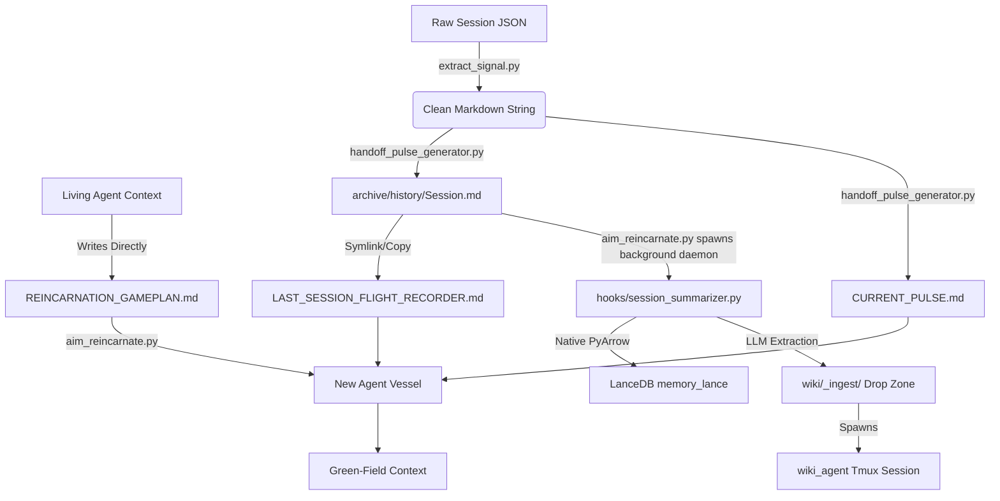

# 🔄 A.I.M. Reincarnation Map: The Continuity Pipeline

> **Core Thesis:** To defeat the "Amnesia Problem," A.I.M. does not just pass memory; it passes **Will**. This document maps the exact sequence of events that occurs when an agent's context fills and it must "reincarnate" into a fresh vessel using the **"Parse Once, Route Everywhere"** architecture.

---

## 🏗️ 1. Technical Components (The Machinery)

| Script | Role | Persona |
| :--- | :--- | :--- |
| `aim_core/aim_reincarnate.py` | **Orchestrator** | The Ferryman: Manages the `tmux` vessel and the final state teleportation. |
| `aim_core/extract_signal.py` | **Noise Filter** | The Harvester: Strips 85% of terminal noise to extract the "Signal Skeleton" and converts it to clean Markdown. |
| `aim_core/handoff_pulse_generator.py` | **The Router** | The Dispatcher: Routes the clean Markdown to the 4 continuity pipelines. (Zero LLM calls). |

---

## 🎬 2. The Unified Reincarnation Pipeline (The Blueprint)

### Phase 1: The Trigger (The Living Agent)
*   The Operator types `/reincarnate`.
*   The active agent writes `continuity/REINCARNATION_GAMEPLAN.md` directly to the disk using its live context (**Zero Python LLM calls**).
*   The agent executes the mechanical script: `python3 aim_core/aim_reincarnate.py "<Commander's Intent>"`.

### Phase 2: The Extraction Engine (Parse Once)
*   The script locates the raw `session.json` file in the native CLI temp folder.
*   It passes the JSON through `extract_signal.py`.
*   **Result:** A single, perfectly formatted, noise-reduced Markdown string is held in active memory.

### Phase 3: The 4-Way Router (Route Everywhere)
The pipeline delegates the single Markdown string across 4 distinct systems using two specific scripts:

1.  **Pipeline 1: The Flight Recorder & Historical Archive**
    *   *Action:* `aim_core/handoff_pulse_generator.py` writes the full transcript to `archive/history/YYYY-MM-DD_HHMM_SessionID.md` and updates `continuity/LAST_SESSION_FLIGHT_RECORDER.md`.
    *   *Purpose:* The master ledger. If the next agent needs deep historical context, it reads this file.
2.  **Pipeline 2: The Current Pulse (Immediate Context)**
    *   *Action:* `aim_core/handoff_pulse_generator.py` slices the last 5 conversational turns and writes them to `continuity/CURRENT_PULSE.md`.
    *   *Purpose:* Gives the newly spawned agent instant, token-cheap awareness of the exact conversation that just ended.
3.  **Pipeline 3: Vector Ingestion (LanceDB)**
    *   *Action:* `aim_core/aim_reincarnate.py` triggers `hooks/session_summarizer.py` via a detached Python `subprocess.Popen` (`--bg`) call.
    *   *Purpose:* The background daemon natively chunks the markdown flight recorder and mathematically embeds it directly into the `memory_lance` RAM pool for instant Hybrid RAG retrieval.
4.  **Pipeline 4: Memory Distillation (The Persistent LLM Wiki)**
    *   *Action:* The detached `session_summarizer.py` daemon continues executing.
    *   *Process:* It extracts a concise list of the session's core architectural takeaways and drops the markdown into `wiki/_ingest/`. It then spawns the `wiki_agent` tmux session to weave those takeaways into the human-readable Markdown Wiki.

### Phase 4: Agent 2 (The Fresh Mind)
1.  **The Wake-up:** Agent 2 wakes up in a fresh `tmux` pane.
2.  **[Epistemic Certainty](Benchmark-Epistemic-Certainty):** It refuses to act until it reads:
    *   `AGENTS.md` (Operating Rules)
    *   `continuity/REINCARNATION_GAMEPLAN.md` (The "Will" of the previous agent)
    *   `continuity/ISSUE_TRACKER.md` (The task list)
3.  **(Optional) Forensic Recall:** If the Gameplan or Operator requires historical context, Agent 2 executes `aim search` to query the vectorized flight recorders.
4.  **Execution:** Agent 2 begins the first task on the Gameplan.

---

## 📡 3. The Data Flow (File Teleportation)

## 🛠️ 4. Key Prompt Injections

### The Wake-Up Mandate (`aim_core/aim_reincarnate.py`)
> "Wake up. MANDATE: 1. Read AGENTS.md and acknowledge your core constraints. 2. Read continuity/REINCARNATION_GAMEPLAN.md and continuity/ISSUE_TRACKER.md before taking any action or responding. (NOTE: Use run_shell_command with 'cat' to read the continuity files, as they are gitignored and your read_file tool will fail)."

---

## ⚠️ 5. Failure Modes & Failsafes

*   **Tmux Missing:** If `tmux` is not found, the script falls back to a manual handoff, printing the session ID and asking the user to manually attach.
*   **V8 Crash:** If the underlying Node.js engine crashes before `aim_reincarnate` triggers, the user runs `aim crash`. This invokes `extract_signal` on the *last saved snapshot* to reconstruct the pulse from the wreckage.